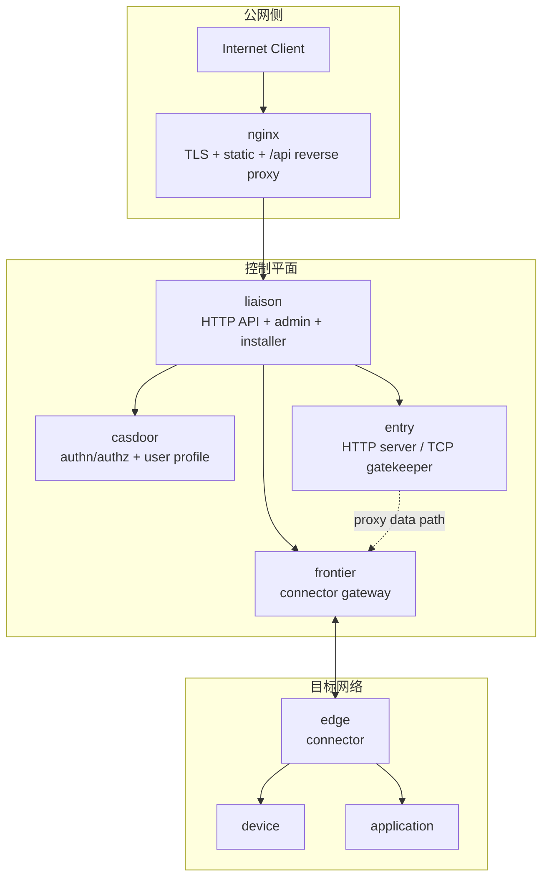
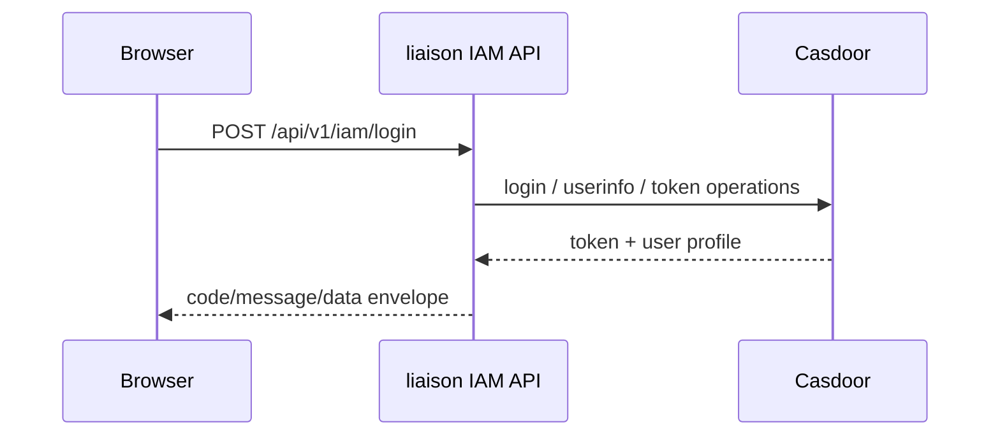
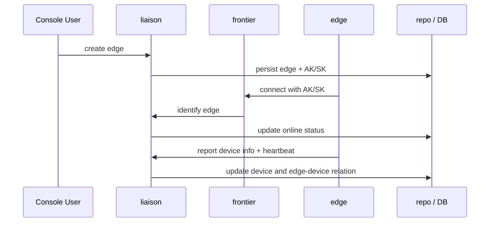
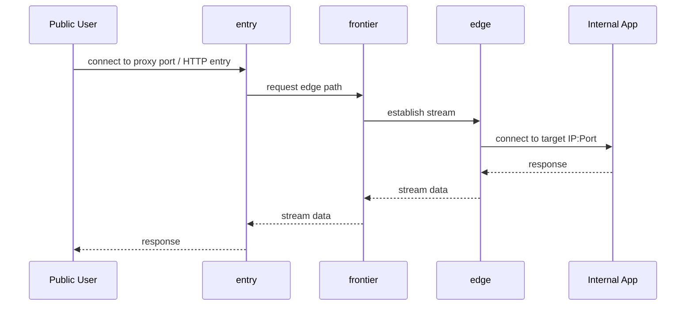

# 架构总览

## 执行摘要

Liaison 的核心价值并不是“打一条临时隧道”，而是把连接器接入、设备上报、应用建模、访问入口和流量统计放进同一套控制面。无论在 `liaison` 还是 `liaison-cloud` 中，核心运行时角色都保持一致：`nginx` 负责 TLS 与静态资源分发，`liaison` 负责控制平面与业务 API，`frontier` 负责 `liaison` 到 `edge` 的连接与消息通道，`edge` 部署在目标网络中，`entry` 在 `liaison` 进程内统一创建对外入口。

`liaison-cloud/spec/architecture.md` 对这套职责边界描述得最明确，因此本页以该文件为主事实源，同时用 `liaison/docs/biz_sequence.md` 补充更细的流程图和 API 级时序。对于接手维护的人，这意味着“看交付材料去 `liaison`，看架构边界去 `liaison-cloud/spec`”。

## 系统拓扑

## 组件职责

| 组件 | 主要职责 | 备注 |
| --- | --- | --- |
| `nginx` | 监听 443、提供官网与 `/admin/` 静态资源、反代 `/api/*` | 不承载业务状态 |
| `liaison` | HTTP API、后台页面、安装脚本、资源模型管理 | 系统主控平面 |
| `casdoor` | 登录、注册、密码重置、令牌签发、用户资料 | `liaison` 不直接读写其库 |
| `frontier` | `liaison` 与 `edge` 之间的连接和消息中枢 | 承接接入、任务和转发控制 |
| `edge` | 设备心跳、信息上报、应用扫描、目标服务转发 | 部署在目标网络 |
| `entry` | 统一创建 HTTP/TCP 访问入口并汇总流量 | 在 `liaison` 进程内 |

## 关键数据流

### 认证流

### 连接器接入与设备上报

### 访问流

## 仓库目录映射

| 逻辑层 | `liaison` | `liaison-cloud` |
| --- | --- | --- |
| 控制面管理 | `pkg/liaison/manager/*` | `pkg/liaison/manager/*` |
| 数据接入 / 连接面 | `pkg/entry/*`, `pkg/edge/frontierbound` | 相同 |
| 仓储层 | `pkg/liaison/repo/*` | 相同 |
| 规格与边界 | 无 | `spec/*` |
| 部署编排 | `deploy-liaison.sh`, `dist/*` | 更完整的 `deploy/`, `spec/`, `website/` |

## 设计观察

- `liaison` 和 `liaison-cloud` 在运行时核心目录上几乎同构，这说明两者不是两个独立产品，而是同一产品的不同仓库阶段。
- `liaison-cloud` 明确把认证外包给 Casdoor，并把 MySQL 作为控制面数据存储；原始 `liaison` 的 `go.mod` 仍保留 SQLite 依赖，反映了演进痕迹。
- 维护时最容易混淆的是“入口在 nginx 还是 liaison”。规范已经明确：所有业务入口统一由 `liaison` 提供，`nginx` 只是 TLS、静态资源和 `/api` 反代层。

**Section sources**
- [spec/architecture.md](file:///Users/zhaizenghui/austinzhai/liaison-cloud/spec/architecture.md#L1)
- [docs/biz_sequence.md](file:///Users/zhaizenghui/austinzhai/liaison/docs/biz_sequence.md#L1)
- [README.md](file:///Users/zhaizenghui/austinzhai/liaison/README.md#L1)
- [README.md](file:///Users/zhaizenghui/austinzhai/liaison-cloud/README.md#L1)
