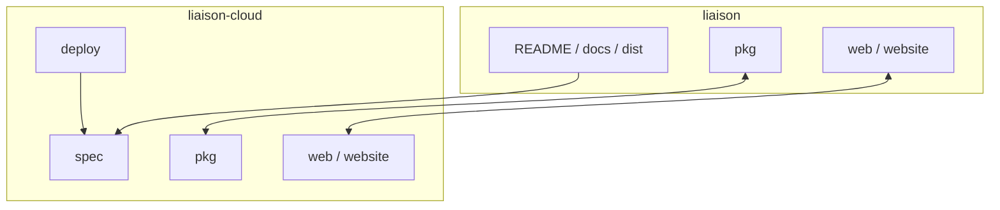

# 文档地图

## 阅读路径

## 当前已生成文档

| 文档 | 主题 | 角色 |
| --- | --- | --- |
| [index.md](./index.md) | 总入口 | 所有人 |
| [architecture.md](./architecture.md) | 运行时拓扑与数据流 | 架构评审、维护者 |
| [repo-relationship.md](./repo-relationship.md) | `liaison` 与 `liaison-cloud` 关系 | 维护者、发布负责人 |
| [getting-started.md](./getting-started.md) | 接手与定位指南 | 新接手者 |

## 后续建议补充的模块页

| 优先级 | 模块 | 原因 |
| --- | --- | --- |
| P1 | `pkg/liaison/manager/*` | 控制面入口最集中 |
| P1 | `pkg/edge/*` | 连接器接入、扫描、上报核心逻辑 |
| P1 | `pkg/entry/*` | 实际访问流量入口 |
| P2 | `pkg/liaison/repo/*` | 数据模型与持久化边界 |
| P2 | `web/` + `website/` | 后台与官网双前端路径 |
| P3 | `deploy-liaison.sh` + `deploy/*` | 部署自动化与环境差异 |

## 目录关系图

**Section sources**
- [README.md](file:///Users/zhaizenghui/austinzhai/liaison/README.md#L1)
- [README.md](file:///Users/zhaizenghui/austinzhai/liaison-cloud/README.md#L1)
- [spec/spec.md](file:///Users/zhaizenghui/austinzhai/liaison-cloud/spec/spec.md#L1)
