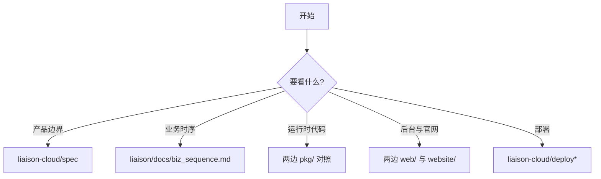

# 快速开始

## 目标

这份文档不是重复安装 README，而是帮助维护者快速判断：当你在本地同时持有 `liaison` 和 `liaison-cloud` 两个仓库时，应该先从哪里入手，才能最快完成理解、排查和修改。

## 先看哪个仓库

| 任务 | 优先仓库 | 原因 |
| --- | --- | --- |
| 理解产品边界 | `liaison-cloud` | 有 `spec/` 和更清晰的架构约束 |
| 查看交付说明 | `liaison` | README、发布包、推广文档更完整 |
| 看当前控制台与官网素材 | 两边都看 | 两边都保留 `web/` 与 `website/` |
| 调整云部署脚本 | `liaison-cloud` | `deploy/` 和 MySQL/Casdoor 路径更完整 |

## 建议阅读顺序

1. 读 `liaison-cloud/spec/spec.md`、`spec/architecture.md`、`spec/conventions.md`。
2. 读 `liaison/README.md` 和 `docs/biz_sequence.md`，确认交付视角与业务时序。
3. 对照两边的 `go.mod`，确认依赖差异，尤其是 SQLite 与 MySQL 的分叉。
4. 再进入各自的 `pkg/`、`web/`、`website/`、`deploy-liaison.sh` 做具体修改。

## 首次扫描命令

```bash
cd /Users/zhaizenghui/austinzhai/liaison-cloud
sed -n '1,220p' spec/spec.md
sed -n '1,240p' spec/architecture.md
sed -n '1,220p' /Users/zhaizenghui/austinzhai/liaison/README.md
```

预期结果：你会先获得“当前实现事实”和“原始交付表达”，再进入代码细节，而不是直接在两个相似仓库里迷路。

## 目录定位



## 下一步建议

- 如果你的目标是生成更完整的模块级文档，下一批优先写 `pkg/liaison/manager`、`pkg/edge`、`pkg/entry` 三个主题页。
- 如果你的目标是统一两仓库内容，优先审查 `website/`、`web/` 和 `deploy-liaison.sh` 三个高漂移目录。

**Section sources**
- [spec/spec.md](file:///Users/zhaizenghui/austinzhai/liaison-cloud/spec/spec.md#L1)
- [spec/architecture.md](file:///Users/zhaizenghui/austinzhai/liaison-cloud/spec/architecture.md#L1)
- [README.md](file:///Users/zhaizenghui/austinzhai/liaison/README.md#L1)
- [docs/biz_sequence.md](file:///Users/zhaizenghui/austinzhai/liaison/docs/biz_sequence.md#L1)
