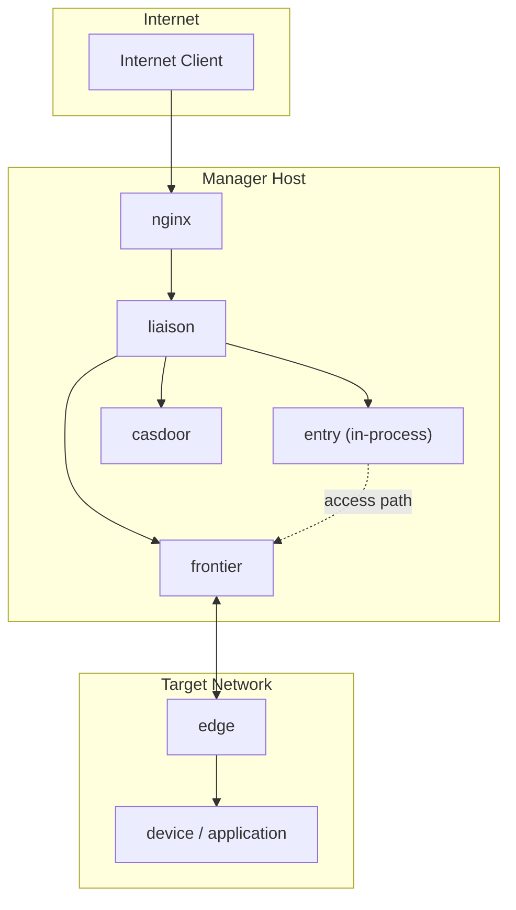

# Liaison Wiki

Liaison 是一套由控制平面、连接器网关、边缘连接器和入口转发组成的远程访问系统。当前本地同时存在两个高度相关的仓库：`liaison` 与 `liaison-cloud`。前者更接近主交付仓库，已经包含发布包、官网、后台构建产物和推广材料；后者在此基础上继续补充了 `spec/` 规格体系、MySQL/Casdoor 部署脚本、静态官网重构和更清晰的产品边界描述。

这套 Wiki 放在 `/Users/zhaizenghui/austinzhai/liaison/.mini-wiki/`，但内容并不只看 `liaison` 一个仓库，而是显式把两个仓库一起扫描后的结论写进来。阅读时应把 `liaison` 视为当前交付视角，把 `liaison-cloud` 视为更完整的实现与规范视角。

## 文档导航

| 文档 | 适合谁看 | 重点 |
| --- | --- | --- |
| [架构总览](./architecture.md) | 架构评审、维护者 | 运行时拓扑、组件职责、关键数据流 |
| [仓库关系](./repo-relationship.md) | 维护者、发布负责人 | `liaison` 与 `liaison-cloud` 的差异与关系 |
| [快速开始](./getting-started.md) | 初次接手者、部署者 | 如何在两个仓库之间定位交付入口 |
| [文档地图](./doc-map.md) | 所有人 | 推荐阅读顺序、目录映射 |

## 架构预览

## 项目统计

| 维度 | `liaison` | `liaison-cloud` | 观察 |
| --- | --- | --- | --- |
| Go module | `github.com/singchia/liaison` | `github.com/singchia/liaison-cloud` | 云仓库已从交付仓库独立命名 |
| 规格目录 | 无 `spec/` | 有 `spec/` | `liaison-cloud` 更适合作为事实源 |
| 数据库驱动 | SQLite + GORM | MySQL + GORM | 反映了从单机/简化交付到云端部署的演进 |
| 官网目录 | `website/` | `website/` | 两边都保留静态官网 |
| 后台目录 | `web/` | `web/` | 两边都保留 Umi/React 后台 |

## 推荐阅读顺序

1. 先读 [仓库关系](./repo-relationship.md)，理解为什么需要同时看两个仓库。
2. 再读 [架构总览](./architecture.md)，理解运行时组件边界。
3. 接着读 [快速开始](./getting-started.md)，定位实际部署和排障入口。
4. 需要继续扩展文档时，回到 [文档地图](./doc-map.md) 查看目录映射。

**Section sources**
- [README.md](file:///Users/zhaizenghui/austinzhai/liaison/README.md#L1)
- [README.md](file:///Users/zhaizenghui/austinzhai/liaison-cloud/README.md#L1)
- [spec/architecture.md](file:///Users/zhaizenghui/austinzhai/liaison-cloud/spec/architecture.md#L1)
- [go.mod](file:///Users/zhaizenghui/austinzhai/liaison/go.mod#L1)
- [go.mod](file:///Users/zhaizenghui/austinzhai/liaison-cloud/go.mod#L1)
