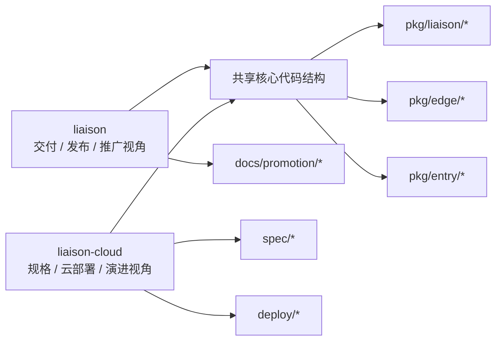

# 仓库关系

## 为什么要同时看两个仓库

本地的 `liaison` 与 `liaison-cloud` 并不是两个完全不同的项目，而是同一产品线在不同阶段的两个仓库形态。它们共享大量 Go 包目录、后台与官网前端目录、发布包目录和测试目录；差异主要集中在部署方式、数据存储、规范化程度和内容完整度。

如果只看 `liaison`，你能快速找到当前交付物、发布包、推广文档和现成截图；如果只看 `liaison-cloud`，你能得到更完整的规格边界、MySQL/Casdoor 部署路径和更清晰的“当前实现事实”。真正有效的维护方式，是把 `liaison-cloud` 当成事实源和演进源，把 `liaison` 当成交付视角与兼容视角。

## 差异总表

| 主题 | `liaison` | `liaison-cloud` | 结论 |
| --- | --- | --- | --- |
| Go module | `github.com/singchia/liaison` | `github.com/singchia/liaison-cloud` | 仓库已拆分命名 |
| 数据库依赖 | `sqlite3`, `gorm.io/driver/sqlite` | `go-sql-driver/mysql`, `gorm.io/driver/mysql` | 云仓库更接近生产部署 |
| 规格目录 | 无 `spec/` | 有完整 `spec/` | 事实边界看 `liaison-cloud` |
| 推广材料 | `docs/promotion/*` | 较少 | 营销/案例材料看 `liaison` |
| 官网与后台 | 两边都有 `website/` / `web/` | 两边都有 | 需要注意双仓库同步问题 |
| 部署脚本 | `deploy-liaison.sh` | `deploy-liaison.sh` + `deploy/*` | `liaison-cloud` 部署维度更全 |

## 仓库关系图

## 维护建议

### 当你要确认“产品现在到底支持什么”

优先看 `liaison-cloud/spec/`。这里明确要求“以当前代码、API、前端页面、测试和部署文件为准”，并把未闭环需求写到 `tasks.md` 或 `roadmap.md`，因此更适合作为架构评审和需求澄清入口。

### 当你要确认“用户最终会拿到什么交付物”

优先看 `liaison`。它保留了发布 tar 包、推广文档、更多现成截图和当前 README 的交付表达，更接近外部消费视角。

### 当你要改动实际运行时代码

两边都要比对。目录同构意味着单边改动很容易造成漂移，例如后台、官网、部署脚本和 API 文档可能在两个仓库中都存在副本。

## 风险与常见误区

- 误把 `liaison` README 当成唯一事实源，会忽略 `liaison-cloud/spec` 中更严格的边界说明。
- 误把 `liaison-cloud` 当成一个完全独立的新产品，会低估它与 `liaison` 在目录和发布物上的重叠。
- 只同步 Go 代码、不同步 `website/`、`web/`、`deploy-liaison.sh`，会导致交付行为和文档描述不一致。

**Section sources**
- [go.mod](file:///Users/zhaizenghui/austinzhai/liaison/go.mod#L1)
- [go.mod](file:///Users/zhaizenghui/austinzhai/liaison-cloud/go.mod#L1)
- [README.md](file:///Users/zhaizenghui/austinzhai/liaison/README.md#L1)
- [README.md](file:///Users/zhaizenghui/austinzhai/liaison-cloud/README.md#L1)
- [spec/spec.md](file:///Users/zhaizenghui/austinzhai/liaison-cloud/spec/spec.md#L1)
