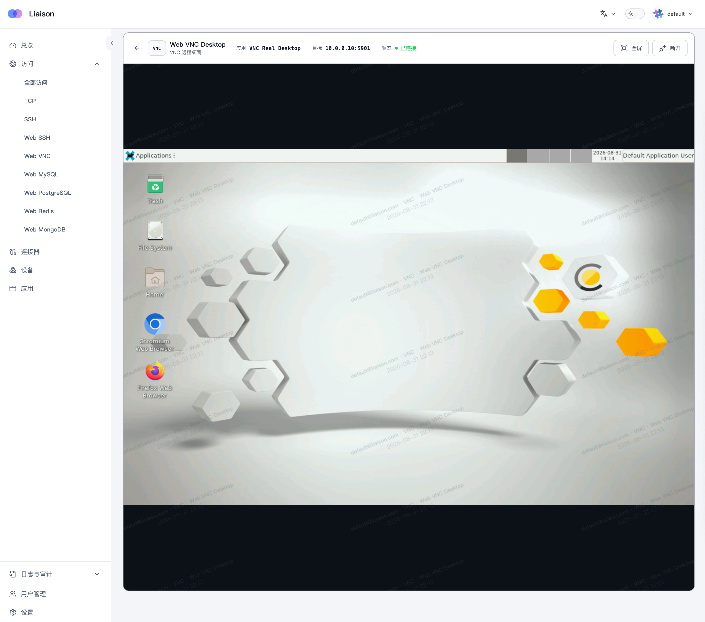
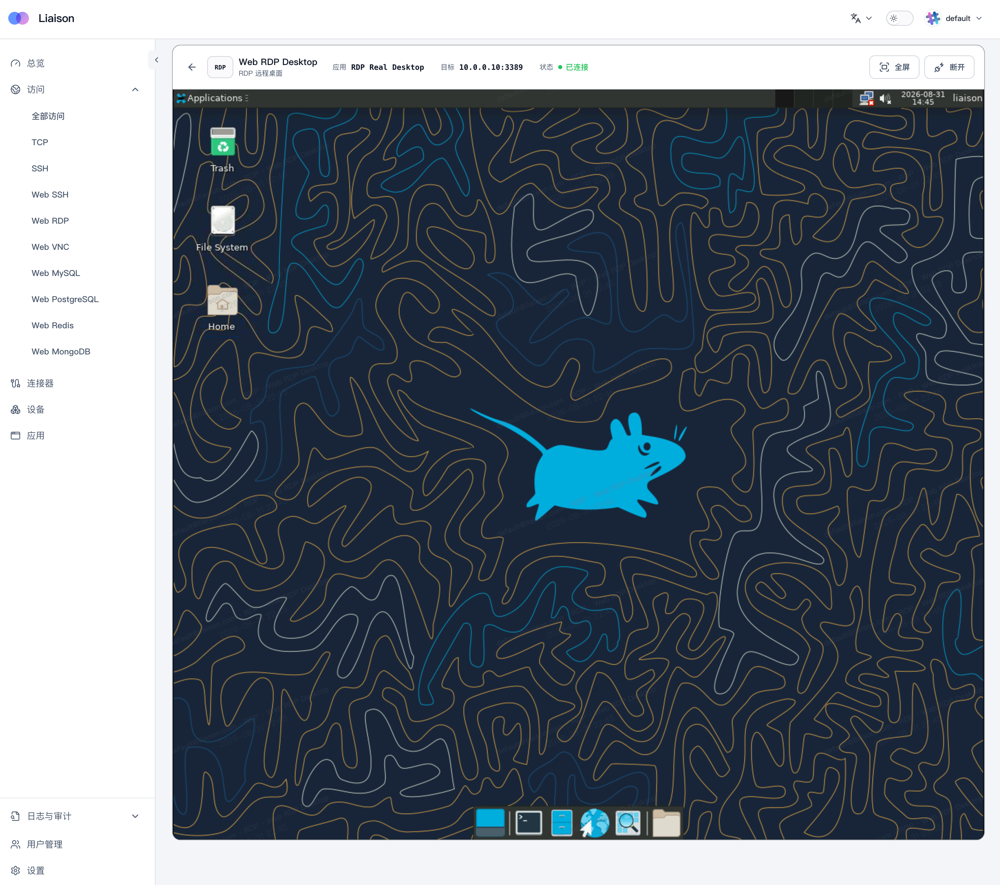

#  Liaison

> **Zero-trust access for private applications.**

Connect private web apps, servers, remote desktops, and databases through outbound connectors, without exposing the private network.

[](https://github.com/liaisonio/liaison/actions/workflows/go.yml)
[](https://goreportcard.com/report/github.com/liaisonio/liaison)
[](https://github.com/liaisonio/liaison/releases)
[](LICENSE)

English | [简体中文](./README_zh.md) | [日本語](./README_ja.md) | [한국어](./README_ko.md) | [Español](./README_es.md) | [Français](./README_fr.md) | [Deutsch](./README_de.md)

[Features](#features) · [Install](#install) · [Product tour](#product-tour) · [Documentation](#documentation) · [Community](#community)

## Product tour

| Private web applications | Private AI assistants |
|:---:|:---:|
|  |  |

| Web VNC | Web RDP |
|:---:|:---:|
|  |  |

## Features

- **Outbound-only connectors** — connect private networks without opening inbound ports on them.
- **Application access** — publish TCP, HTTP, HTTPS, WebSocket, and SSH services with per-access controls.
- **Browser workspaces** — use Web SSH, RDP, VNC, MySQL, PostgreSQL, Redis, and MongoDB without local clients.
- **Application discovery** — scan connector devices and register discovered services from the console.
- **Identity and access management** — organize users and resources, with Casbin-backed authorization.
- **Firewall policies** — restrict TCP and HTTP access by source IP and CIDR.
- **Logs and audit** — record management actions and supported application sessions in one place.
- **Self-hosted deployment** — run the complete control plane on your own Linux server.

## How it works

1. Install Liaison on a public Linux server.
2. Create a connector in the Web console and run its generated install command on a private device.
3. Register or discover an application reachable by that connector.
4. Create an access policy and connect through Liaison.

Connectors initiate the connection to Liaison, so the private network does not need a public address or an inbound firewall rule.

## Install

Choose a server package from the [latest release](https://github.com/liaisonio/liaison/releases/latest), then install a connector from the Web console.

### Binary and systemd

```bash
wget https://github.com/liaisonio/liaison/releases/download/v1.8.0/liaison-1.8.0-linux-amd64.tar.gz
tar -xzf liaison-1.8.0-linux-amd64.tar.gz
cd liaison-1.8.0-linux-amd64
sudo ./install.sh
```

Open `https://<server-address>` after installation. The installer prints the initial sign-in credentials.

### Docker Compose

```bash
wget https://github.com/liaisonio/liaison/releases/download/v1.8.0/liaison-1.8.0-docker-amd64.tar.gz
tar -xzf liaison-1.8.0-docker-amd64.tar.gz
cd liaison-1.8.0-docker-amd64
./load.sh
```

The bundle contains the required images. Runtime data, certificates, and logs are stored beside the Compose file. See the [Docker deployment guide](deploy/docker/README.md) for configuration, upgrades, reverse proxies, and custom certificates.

### Connector

In the Web console, open **Connectors**, create one, copy the generated command, and run it on the target Linux, macOS, or Windows device.

## Documentation

- [Docker deployment](deploy/docker/README.md)
- [API reference](docs/swagger/swagger.yaml)
- [Release notes](https://github.com/liaisonio/liaison/releases)
- [Issues](https://github.com/liaisonio/liaison/issues)
- [Discussions](https://github.com/liaisonio/liaison/discussions)

## Community

<div align="center">


Scan with WeChat to join the Liaison developer community.

</div>

## Contributing

Bug reports, feature proposals, documentation improvements, and pull requests are welcome. Start with [Issues](https://github.com/liaisonio/liaison/issues) or open a [Pull Request](https://github.com/liaisonio/liaison/pulls).

## License

Liaison is licensed under the [Apache License 2.0](LICENSE).
