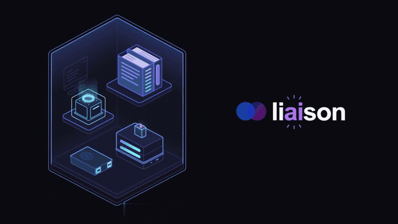
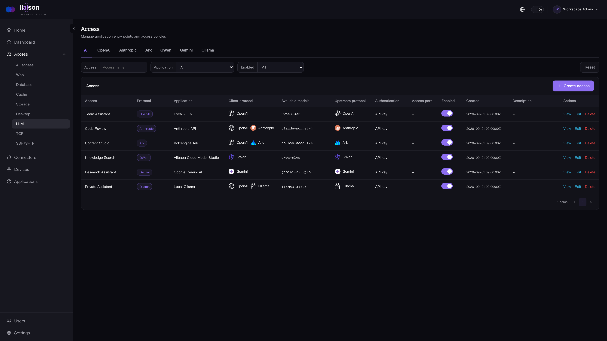

<picture>
  <source media="(prefers-color-scheme: dark)" srcset="docs/assets/liaison-brand-rays-dark.svg" />
  
</picture>

> **AI-native zero-trust access for local LLMs and applications.**

Self-hosted, with secure API sharing, browser workspaces, and context-aware AI Agents.

[](https://github.com/liaisonio/liaison/actions/workflows/go.yml)
[](https://github.com/liaisonio/liaison/releases)
[](https://github.com/liaisonio/liaison/releases)
[](LICENSE)
[](go.mod)
[](web/package.json)
[](web/package.json)
[](web/vite.config.ts)
[](web/tailwind.config.cjs)

English | [简体中文](./README_zh.md) | [日本語](./README_ja.md) | [한국어](./README_ko.md) | [Español](./README_es.md) | [Français](./README_fr.md) | [Deutsch](./README_de.md)

[Website](https://liaison.cloud) · [Docs](https://liaison.cloud/docs/get-started/introduction) · [Features](#features) · [Install](#install) · [Access protocols](#supported-access-protocols) · [Agent models](#agent-model-providers) · [Product tour](#product-tour)



## Features

- 🤖 **Local LLM access** — Share local models beyond your network through authenticated APIs and a browser Playground.
- 🔑 **Controlled API sharing** — Scope keys to models, set Token quotas, revoke access, and review usage and request records.
- ✨ **AI in your workflow** — Inspect terminal output, draft commands, and query databases with an Agent tied to your connection. Tool access follows user permissions; operations requiring approval wait for your confirmation.
- 💬 **Ask about your resources** — Find and inspect your connectors, devices, and applications from the home Agent. Resource visibility stays scoped to the signed-in user.
- 🔌 **Outbound-only connectors** — connect private networks without opening inbound ports on them.
- 🔐 **Application access** — publish TCP, HTTP, HTTPS, WebSocket, and SSH services with per-access controls.
- 🖥️ **Browser workspaces** — WebSSH, WebSFTP, WebRDP, WebVNC, MySQL, MariaDB, PostgreSQL, SQL Server, Oracle, ClickHouse, MongoDB, Elasticsearch, OpenSearch, Redis, and Memcached.
- 📁 **Files and objects** — Manage remote files with WebSFTP. Browse buckets, prefixes, and object metadata from S3-compatible services with WebS3 (currently read-only).
- 🔎 **Application discovery** — scan connector devices and register discovered services from the console.
- 👥 **Identity and access management** — organize users and resources, with Casbin-backed authorization.
- 🛡️ **Firewall policies** — restrict TCP and HTTP access by source IP and CIDR.
- 📋 **Logs and audit** — record management actions and supported application sessions in one place.
- 📦 **Self-hosted deployment** — run the complete control plane on your own Linux server.

## Install

Download the self-contained Docker bundle, extract it, and run the installer (Docker 20.10+ with Compose is required):

```bash
wget https://github.com/liaisonio/liaison/releases/download/v1.13.0/liaison-1.13.0-linux-amd64.tar.gz
tar -xzf liaison-1.13.0-linux-amd64.tar.gz
cd liaison-1.13.0-linux-amd64
./install.sh
```

Open `https://<server-address>` after installation. The installer prints the initial sign-in credentials.

## Supported access protocols

Access your existing private services through Liaison.

<table>
  <tr><th align="left">SSH / SFTP</th><td>&nbsp;&nbsp; </td></tr>
  <tr><th align="left">Desktop</th><td>&nbsp;&nbsp; </td></tr>
  <tr><th align="left">SQL databases</th><td>&nbsp;&nbsp; &nbsp;&nbsp; &nbsp;&nbsp; &nbsp;&nbsp; &nbsp;&nbsp; </td></tr>
  <tr><th align="left">Data & search</th><td>&nbsp;&nbsp; &nbsp;&nbsp; </td></tr>
  <tr><th align="left">Cache</th><td>&nbsp;&nbsp; </td></tr>
  <tr><th align="left">Storage</th><td></td></tr>
  <tr><th align="left">LLM upstream protocols</th><td><picture><source media="(prefers-color-scheme: dark)" srcset="docs/assets/integrations/readme/openai-dark.svg" /></picture>&nbsp;&nbsp; &nbsp;&nbsp; <picture><source media="(prefers-color-scheme: dark)" srcset="docs/assets/integrations/readme/ollama-dark.svg" /></picture></td></tr>
  <tr><th align="left">Web / TCP</th><td>&nbsp;&nbsp; </td></tr>
</table>

LLM upstreams support **OpenAI-compatible**, **Anthropic Messages**, and **Ollama**. Clients use OpenAI-compatible endpoints; Anthropic upstreams also expose native Messages endpoints. Logos identify existing services you can access, not products bundled or deployed by Liaison. Database and desktop logos refer to browser workspaces, not native database/RDP/VNC server listeners.

## Agent model providers

Configure the model behind Liaison’s built-in Agent, independently of service access.

<table>
  <tr>
    <th align="left">Models</th>
    <td><picture><source media="(prefers-color-scheme: dark)" srcset="docs/assets/integrations/readme/openai-dark.svg" /></picture>&nbsp;&nbsp; &nbsp;&nbsp; &nbsp;&nbsp; &nbsp;&nbsp; <picture><source media="(prefers-color-scheme: dark)" srcset="docs/assets/integrations/readme/zhipu-dark.svg" /></picture>&nbsp;&nbsp; <picture><source media="(prefers-color-scheme: dark)" srcset="docs/assets/integrations/readme/kimi-dark.svg" /></picture>&nbsp;&nbsp; &nbsp;&nbsp; <picture><source media="(prefers-color-scheme: dark)" srcset="docs/assets/integrations/readme/mimo-dark.svg" /></picture></td>
  </tr>
</table>

Eight provider presets, plus custom OpenAI-compatible services.

## Product tour

### Local LLM access



### Web SSH

Work in an audited browser terminal with an Agent that can inspect session output and help draft commands.


### Private web applications

Access media servers and other internal web applications through Liaison.


### Private AI assistants

Keep internal AI tools reachable without exposing the private network.


### Web MySQL

Browse schemas, run SQL, and ask the session Agent to query and explain results, with approval where required.


### Web MongoDB

Explore collections and ask the session Agent to run approved queries and explain documents, without a local client.


### Web VNC

Open a private VNC desktop in a managed browser session.


### Web RDP

Connect to an RDP desktop from the same access workflow.


## Documentation

- [Docker deployment](deploy/docker/README.md)
- [API reference](docs/swagger/swagger.yaml)
- [Release notes](https://github.com/liaisonio/liaison/releases)
- [Issues](https://github.com/liaisonio/liaison/issues)
- [Discussions](https://github.com/liaisonio/liaison/discussions)

## Contributing

Bug reports, feature proposals, documentation improvements, and pull requests are welcome. Start with [Issues](https://github.com/liaisonio/liaison/issues) or open a [Pull Request](https://github.com/liaisonio/liaison/pulls).

## License

Liaison is licensed under the [GNU Affero General Public License v3.0](LICENSE).
