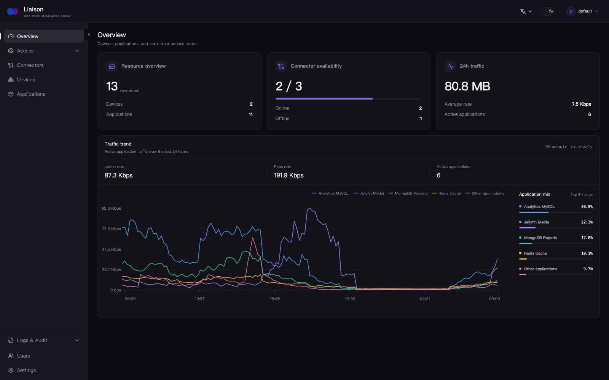
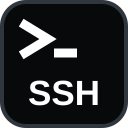
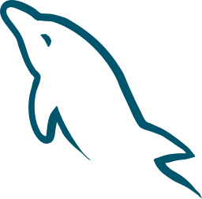
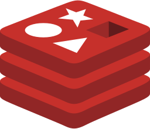
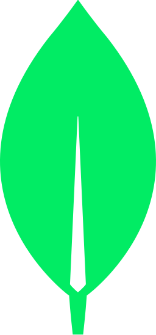
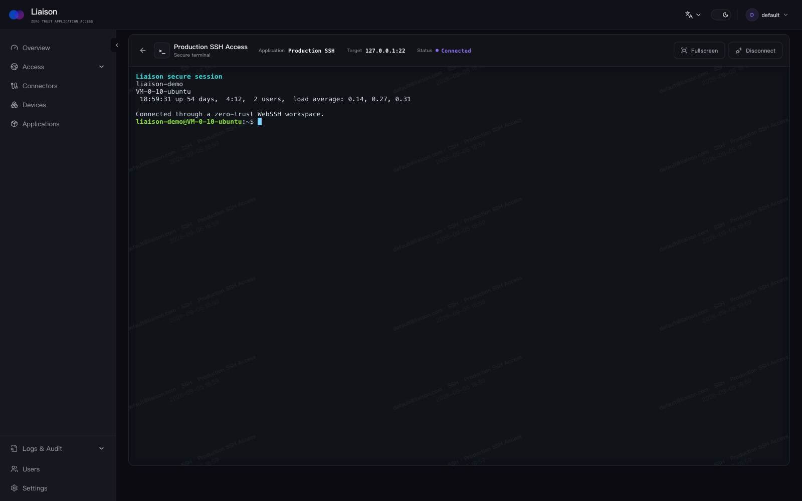
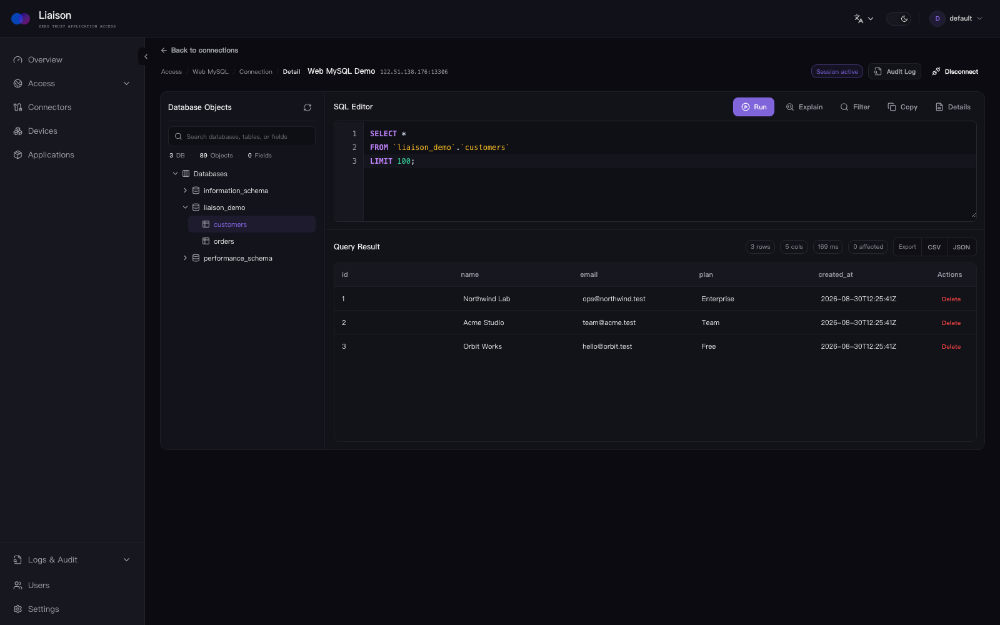
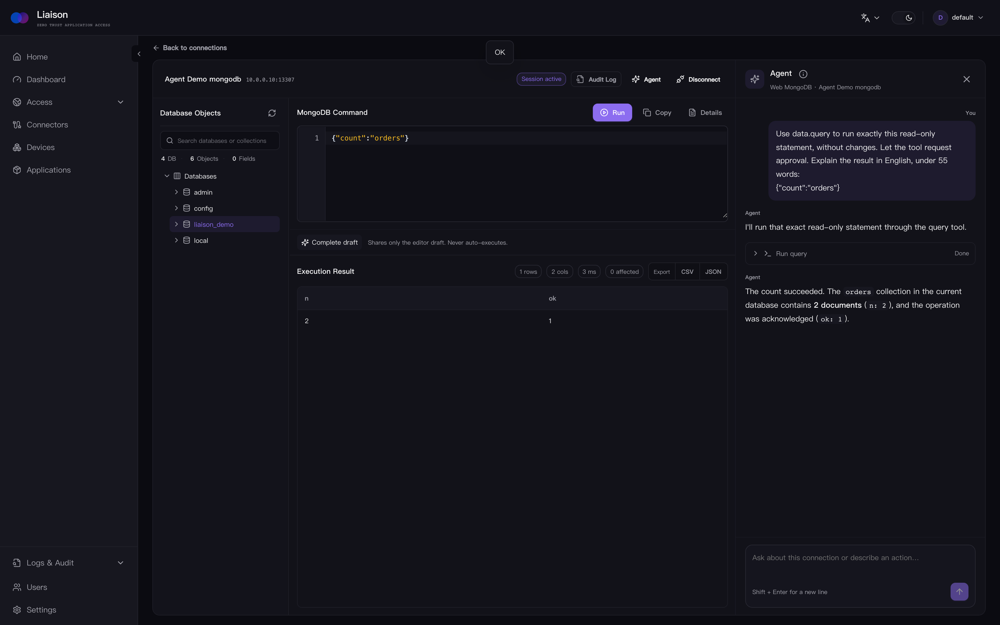
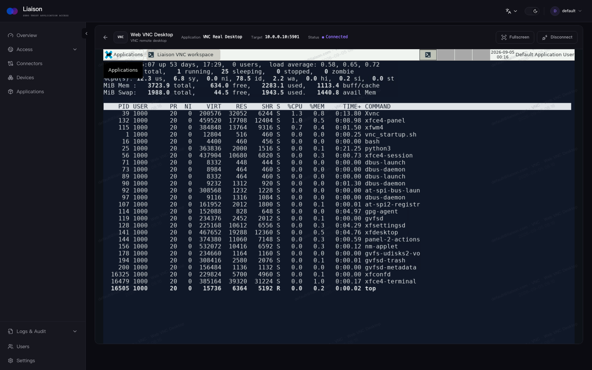
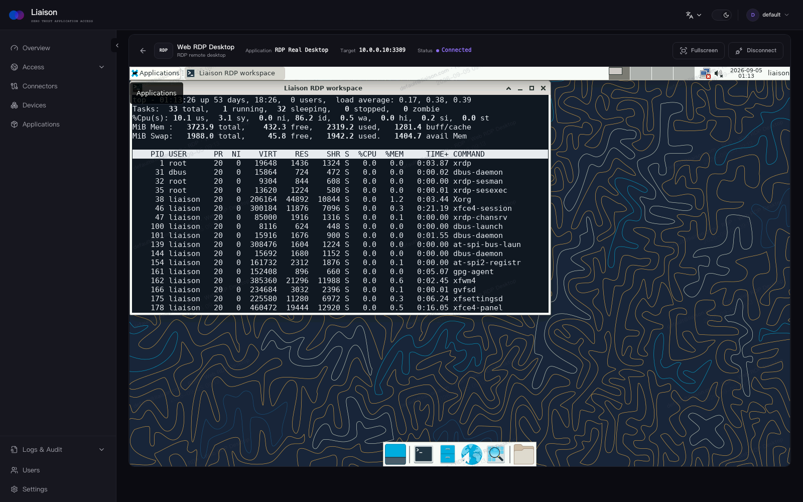

#  Liaison

> **Zero-trust access for private applications.**

Connect private web apps, servers, remote desktops, and databases through outbound connectors, without exposing the private network.

[](https://github.com/liaisonio/liaison/actions/workflows/go.yml)
[](https://goreportcard.com/report/github.com/liaisonio/liaison)
[](https://github.com/liaisonio/liaison/releases)
[](LICENSE)

English | [简体中文](./README_zh.md) | [日本語](./README_ja.md) | [한국어](./README_ko.md) | [Español](./README_es.md) | [Français](./README_fr.md) | [Deutsch](./README_de.md)

[Features](#features) · [Install](#install) · [Integrations](#integrations) · [Product tour](#product-tour) · [Documentation](#documentation)



## Features

- 🔌 **Outbound-only connectors** — connect private networks without opening inbound ports on them.
- 🔐 **Application access** — publish TCP, HTTP, HTTPS, WebSocket, and SSH services with per-access controls.
- 🖥️ **Browser workspaces** — use Web SSH, RDP, VNC, MySQL, PostgreSQL, Redis, and MongoDB without local clients.
- 🔎 **Application discovery** — scan connector devices and register discovered services from the console.
- 👥 **Identity and access management** — organize users and resources, with Casbin-backed authorization.
- 🛡️ **Firewall policies** — restrict TCP and HTTP access by source IP and CIDR.
- 📋 **Logs and audit** — record management actions and supported application sessions in one place.
- 📦 **Self-hosted deployment** — run the complete control plane on your own Linux server.

## Install

Download the self-contained Docker bundle, extract it, and run the loader (Docker 20.10+ with Compose is required):

```bash
wget https://github.com/liaisonio/liaison/releases/download/v1.10.0/liaison-1.10.0-linux-amd64.tar.gz
tar -xzf liaison-1.10.0-linux-amd64.tar.gz
cd liaison-1.10.0-linux-amd64
./install.sh
```

Open `https://<server-address>` after installation. The installer prints the initial sign-in credentials.

## Integrations

Native protocols and browser workspaces supported by Liaison.

<p align="center">
  &nbsp;&nbsp;&nbsp;&nbsp;
  &nbsp;&nbsp;&nbsp;&nbsp;
  &nbsp;&nbsp;&nbsp;&nbsp;
  &nbsp;&nbsp;&nbsp;&nbsp;
  &nbsp;&nbsp;&nbsp;&nbsp;
  &nbsp;&nbsp;&nbsp;&nbsp;
  
</p>

## Product tour

### Web SSH

Open an audited SSH terminal in the browser without exposing the private server.



### Private web applications

Access media servers and other internal web applications through Liaison.


### Private AI assistants

Keep internal AI tools reachable without exposing the private network.


### Web MySQL

Inspect schemas and run audited SQL queries directly in the browser.



### Web MongoDB

Explore document databases and execute commands without a local client.



### Web VNC

Open a private VNC desktop in a managed browser session.



### Web RDP

Connect to an RDP desktop from the same access workflow.



## Documentation

- [Docker deployment](deploy/docker/README.md)
- [API reference](docs/swagger/swagger.yaml)
- [Release notes](https://github.com/liaisonio/liaison/releases)
- [Issues](https://github.com/liaisonio/liaison/issues)
- [Discussions](https://github.com/liaisonio/liaison/discussions)

## Contributing

Bug reports, feature proposals, documentation improvements, and pull requests are welcome. Start with [Issues](https://github.com/liaisonio/liaison/issues) or open a [Pull Request](https://github.com/liaisonio/liaison/pulls).

## License

Liaison is licensed under the [GNU Affero General Public License v3.0](LICENSE).
