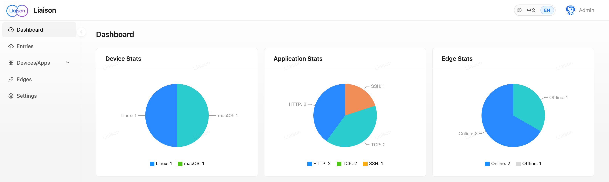
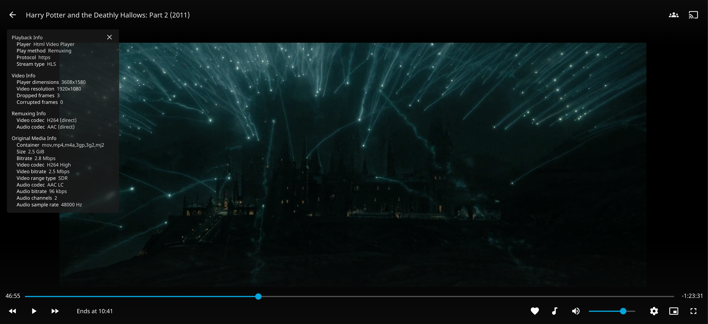
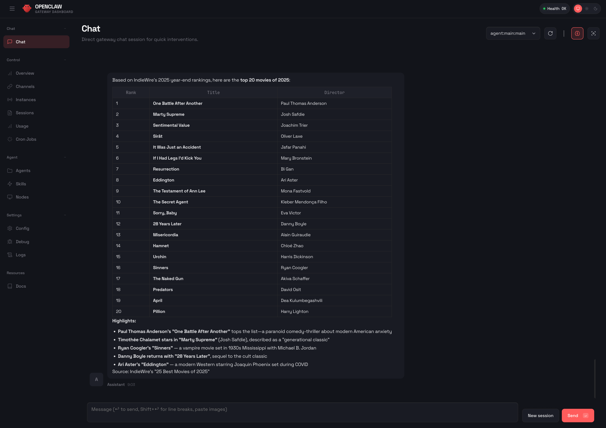
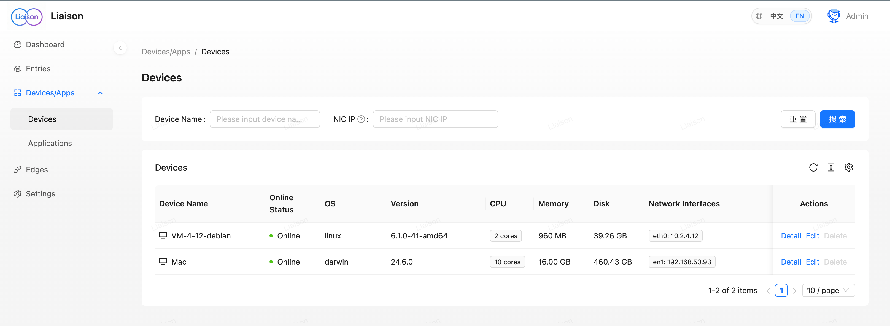
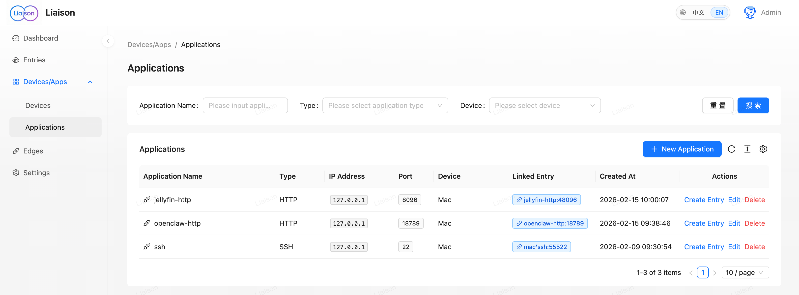
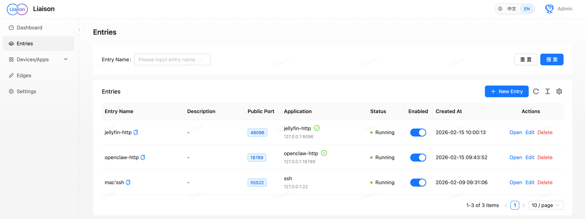
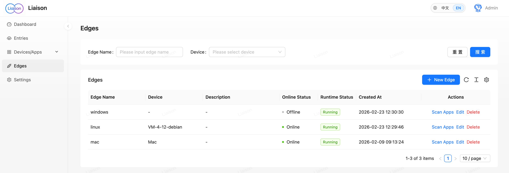

#  Liaison

> **AI 기반 프라이빗 애플리케이션 제로 트러스트 액세스.**

[](https://github.com/liaisonio/liaison/actions/workflows/go.yml)
[](https://goreportcard.com/report/github.com/liaisonio/liaison)
[](LICENSE)
[](#)
[](#)

[简体中文](./README_zh.md) | [English](./README.md) | [日本語](./README_ja.md) | 한국어 | [Español](./README_es.md) | [Français](./README_fr.md) | [Deutsch](./README_de.md)



| Jellyfin(언제 어디서나 홈 무비 스트리밍) | OpenClaw(언제 어디서나 홈 AI 사용) |
|:---:|:---:|
|  |  |

[빠른 시작](#빠른-시작) • [소개](#소개) • [문서](#문서) • [기여](#기여)

---

## 소개

프라이빗 서버, 데이터베이스, 데스크톱, 웹 앱에 연결하세요. SSH 및 데이터베이스 세션의 AI Agent와 작업하고 홈 Agent에서 접근 가능한 커넥터, 기기, 앱을 확인하세요. 셀프 호스팅을 지원하며 도구는 사용자 권한을 따릅니다.

- ✨ **작업 흐름 속 AI** — 현재 연결의 Agent가 터미널 출력 확인, 명령 작성, 데이터베이스 조회를 돕습니다. 승인이 필요한 작업은 확인을 기다립니다.
- 💬 **대화로 리소스 확인** — 홈 Agent에서 커넥터, 기기, 앱을 찾으세요. 리소스는 로그인한 사용자의 권한 범위로 제한됩니다.

이 프로젝트는 다음 문제를 해결합니다:

- **프라이빗 네트워크 접근** — 최소 설정으로 공용 인터넷에서 NAT 뒤의 기기·서비스에 도달
- **다기기 관리** — Linux/macOS/Windows 를 통합 지원하며 여러 위치의 기기를 한 곳에서 관리
- **보안 연결** — LAN / 홈 네트워크 포트를 노출하지 않고 TLS 로 암호화된 전송 사용
- **엔트리 단위 방화벽** — TCP / HTTP 각 엔트리에 출발지 IP CIDR 허용 목록을 지정하여 연결 수락 단계에서 차단
- **트래픽 모니터링** — 운영 및 용량 산정을 위한 실시간 기기 상태·트래픽 통계
- **애플리케이션 프록시** — TCP, HTTP/HTTPS, WebSocket 등 다양한 프로토콜 지원
- **API 자동화** — CLI / 스크립트용 Personal Access Token(PAT), `/cli-auth` 에서 브라우저 기반 로그인 플로우 제공

사용 사례:

<div align="center">

| **💼 원격 근무 & 개발** | **🧑‍💻 개인 스튜디오** | **🏠 홈 네트워크 / NAS** | **🌐 멀티 데이터센터** | **⚡ 엣지 & 운영** |
|:---:|:---:|:---:|:---:|:---:|
| 사무실과 가정의 기기를 연결하여 원격 개발 / 디버깅 | 워크스테이션과 프라이빗 환경을 안전하게 연결해 장비 통합 관리 | 홈 NAS 와 스마트홈 서비스를 공용 인터넷에서 이용 | 여러 리전·DC 의 서버와 애플리케이션을 통합 연결 | 엣지 앱을 원격으로 모니터링하고 상태·트래픽 점검 |

</div>

---

## 빠른 시작

다음 tar.gz 서버 패키지를 설치한 뒤 커넥터를 설치하세요.

### 서버 설치 — tar.gz

**1. 다운로드**

```bash
wget https://github.com/liaisonio/liaison/releases/download/v1.12.0/liaison-1.12.0-linux-amd64.tar.gz
tar -xzf liaison-1.12.0-linux-amd64.tar.gz
cd liaison-1.12.0-linux-amd64
```

**2. 설치 스크립트 실행**

```bash
./install.sh
```

공용 IP 또는 도메인 입력이 요청됩니다. 30 초 내에 입력하지 않으면 자동 감지된 공용 IP 가 사용됩니다.

**3. 웹 콘솔 열기**

`https://공용IP` 에 접속해 웹 콘솔로 이동합니다.

> **팁:** 기본 관리자 자격 증명은 install.sh 출력 또는 설정 파일에서 확인하세요.

### 커넥터 설치

대상 기기에 맞춰 두 가지 설치 경로 중 하나를 선택하세요.

#### 옵션 A — Liaison Desktop (GUI, macOS / Windows)

커넥터를 감싸는 메뉴바 / 트레이 앱입니다. 원클릭 로그인, 상태 표시, 일시정지 / 재개, 대시보드 원클릭 접근을 제공합니다. 노트북과 워크스테이션에 적합합니다.

<div align="center">

| macOS | Windows |
|:---:|:---:|
|  |  |

</div>

- **원클릭 로그인** — 브라우저 OAuth 흐름, PAT 은 OS 키체인 (macOS Keychain, Windows 자격 증명 관리자)에 저장
- **멀티 배포** — 기본값은 `liaison.cloud`, 좌하단 톱니바퀴 아이콘으로 어떤 프라이빗 배포로든 재설치 없이 즉시 전환
- **하트비트 기반 상태** — 연결 중 → 온라인 전환은 실제 터널 상태를 반영 (프로세스 생존 여부만이 아님)
- **재시작 후에도 유지되는 일시정지** — 사용자 의도가 디스크에 영속화되어 재시작 후에도 Paused 유지

**다운로드 (롤링 프리릴리스, `feat/desktop-client` 최신 빌드):**

| 플랫폼 | 파일 |
|:---|:---|
| macOS (Apple Silicon + Intel 유니버설) | [`Liaison_0.1.0_universal.dmg`](https://github.com/liaisonio/liaison/releases/download/desktop-latest/Liaison_0.1.0_universal.dmg) |
| Windows (.msi 설치 프로그램) | [`Liaison_0.1.0_x64_en-US.msi`](https://github.com/liaisonio/liaison/releases/download/desktop-latest/Liaison_0.1.0_x64_en-US.msi) |
| Windows (.exe NSIS, 제거 시 키체인 정리 포함) | [`Liaison_0.1.0_x64-setup.exe`](https://github.com/liaisonio/liaison/releases/download/desktop-latest/Liaison_0.1.0_x64-setup.exe) |

> v0.1 설치 프로그램은 서명되지 않았습니다. macOS Gatekeeper 와 Windows SmartScreen 이 첫 실행 시 경고를 표시합니다 — macOS 는 우클릭 → 열기, Windows 는 "추가 정보" → "실행"을 선택하세요. Windows 에는 WebView2 Runtime 이 필요합니다 (Win10 1803+ 와 Win11 에 기본 포함).

#### 옵션 B — CLI 설치 명령 (Linux / 헤드리스)

웹 콘솔에서 **새 커넥터를 생성**하고, UI 에서 대상 플랫폼용 설치 명령을 복사해 대상 기기에서 실행하면 커넥터가 콘솔에 자동으로 나타납니다.

---

## 시스템 요구사항

| 구성요소 | 요구사항 |
|:---|:---|
| **서버** | Linux (Ubuntu 20.04+ 또는 CentOS 7+ 권장) |
| **커넥터** | Linux / macOS / Windows (x86_64 및 ARM64) |
| **브라우저** | Chrome 90+, Firefox 88+, Safari 14+, Edge 90+ |

---

## 아키텍처


Liaison 은 Frontier 가 모든 커넥터를 관리하는 중앙 집중식 아키텍처를 사용합니다.

**구성 요소**

- **Liaison** — 웹 UI 및 API, 애플리케이션 진입점
- **Frontier** — 커넥터 연결 및 트래픽 라우팅을 담당하는 게이트웨이
- **Edge** — 대상 기기에서 구동되는 커넥터 클라이언트

---

## 기능 소개

| 기능 | 스크린샷 |
|:---:|:---:|
| 기기 관리 |  |
| 애플리케이션 관리 |  |
| 프록시 설정 |  |
| 커넥터 관리 |  |

---

## 문서

- [비즈니스 플로우](./docs/biz_sequence.md)
- [API](./docs/swagger/)

---

## 기여

기여는 언제나 환영합니다.

- [버그 리포트](https://github.com/liaisonio/liaison/issues/new?template=bug_report.md)
- [기능 제안](https://github.com/liaisonio/liaison/issues/new?template=feature_request.md)
- [PR 제출](https://github.com/liaisonio/liaison/pulls)
- [문서 개선](https://github.com/liaisonio/liaison/issues/new?template=documentation.md)

1. 레포지토리 Fork
2. 브랜치 생성 (`git checkout -b feature/AmazingFeature`)
3. 커밋 (`git commit -m 'Add some AmazingFeature'`)
4. Push (`git push origin feature/AmazingFeature`)
5. Pull Request 열기

---

## 라이선스

[GNU Affero General Public License v3.0](LICENSE).

---

<div align="center">

**프로젝트가 도움이 되셨다면 ⭐ Star 를 눌러주세요!**

Made with ❤️ by [Liaison Contributors](https://github.com/liaisonio/liaison/graphs/contributors)

[GitHub](https://github.com/liaisonio/liaison) • [Issues](https://github.com/liaisonio/liaison/issues) • [Discussions](https://github.com/liaisonio/liaison/discussions)

</div>
