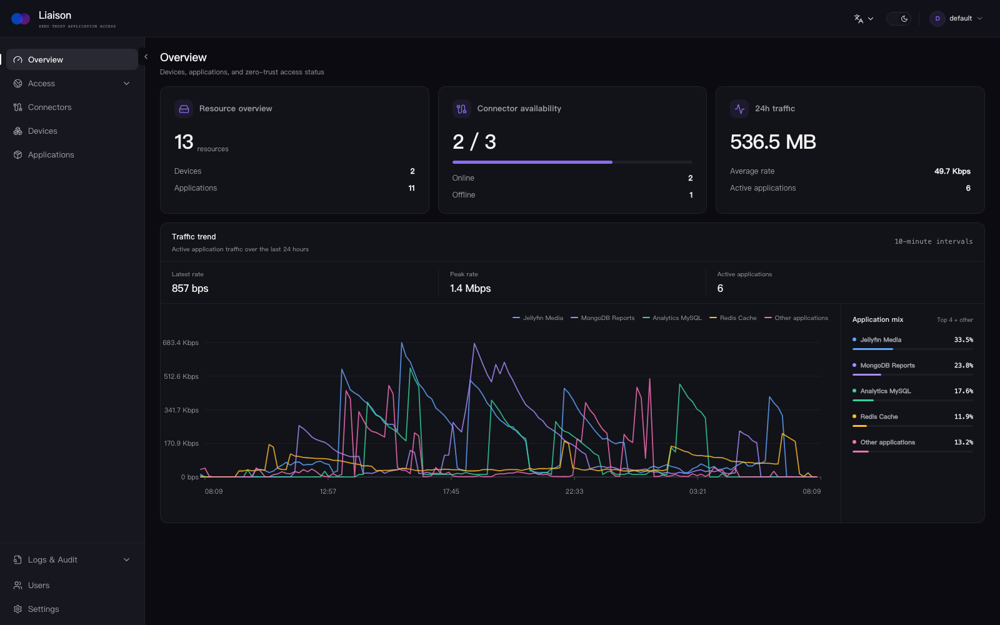
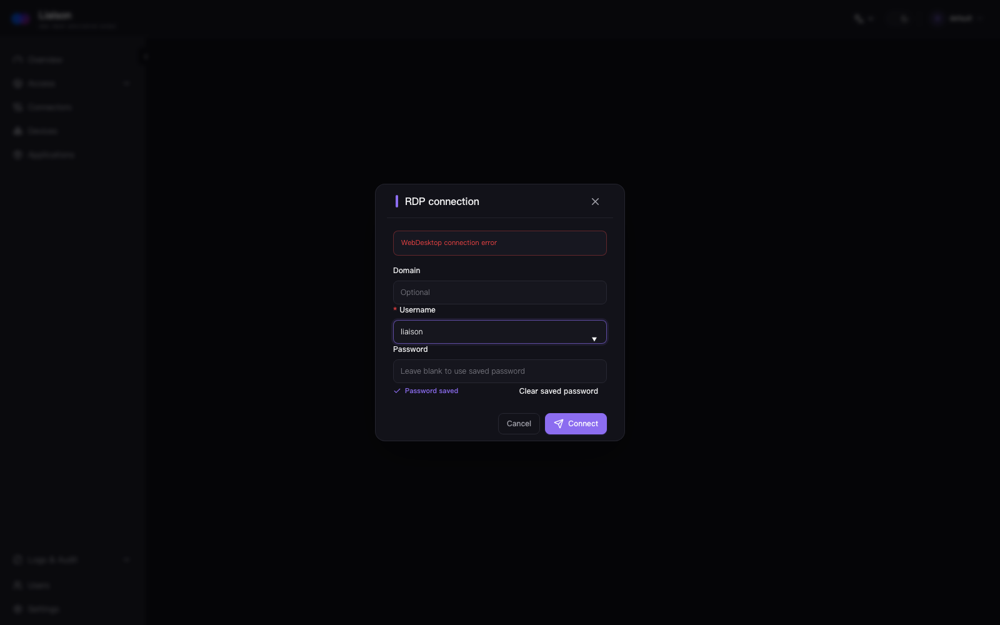

#  Liaison

> **面向私有应用的零信任访问。**

通过主动出站的连接器访问私有 Web 应用、服务器、远程桌面与数据库，无需暴露私有网络。

[](https://github.com/liaisonio/liaison/actions/workflows/go.yml)
[](https://goreportcard.com/report/github.com/liaisonio/liaison)
[](https://github.com/liaisonio/liaison/releases)
[](LICENSE)

[English](./README.md) | 简体中文 | [日本語](./README_ja.md) | [한국어](./README_ko.md) | [Español](./README_es.md) | [Français](./README_fr.md) | [Deutsch](./README_de.md)

[产品能力](#产品能力) · [安装](#安装) · [集成](#集成) · [产品展示](#产品展示) · [文档](#文档) · [社区](#社区)



## 产品能力

- 🔌 **主动出站连接器**：私有网络无需开放入站端口。
- 🔐 **应用访问**：支持 TCP、HTTP、HTTPS、WebSocket 与 SSH，并可独立配置访问策略。
- 🖥️ **浏览器工作台**：无需本地客户端即可使用 Web SSH、RDP、VNC、MySQL、PostgreSQL、Redis 和 MongoDB。
- 🔎 **应用发现**：扫描连接器所在设备，并在控制台中登记发现的服务。
- 👥 **身份与权限**：管理组织、用户与资源，权限由 Casbin 统一执行。
- 🛡️ **防火墙策略**：按来源 IP 与 CIDR 限制 TCP 和 HTTP 访问。
- 📋 **日志与审计**：集中记录管理操作与支持审计的应用会话。
- 📦 **私有化部署**：完整控制平面运行在自己的 Linux 服务器上。

## 安装

下载 Linux 服务端压缩包，解压后运行安装脚本：

```bash
wget https://github.com/liaisonio/liaison/releases/download/v1.8.0/liaison-1.8.0-linux-amd64.tar.gz
tar -xzf liaison-1.8.0-linux-amd64.tar.gz
cd liaison-1.8.0-linux-amd64
sudo ./install.sh
```

安装完成后访问 `https://<服务器地址>`，初始登录信息会由安装脚本输出。

## 集成

<div align="center">

| | | | | | | | | |
|:---:|:---:|:---:|:---:|:---:|:---:|:---:|:---:|:---:|
| <br><sub>TCP</sub> | <br><sub>HTTP</sub> | <br><sub>SSH</sub> | <br><sub>RDP</sub> | <br><sub>VNC</sub> | <br><sub>MySQL</sub> | <br><sub>PostgreSQL</sub> | <br><sub>Redis</sub> | <br><sub>MongoDB</sub> |

</div>

## 产品展示

### 私有 Web 应用

通过 Liaison 访问媒体服务及其他内部 Web 应用。


### 私有 AI 助手

无需暴露私有网络，也能安全访问内部 AI 工具。


### Web MySQL

直接在浏览器中查看表结构并执行可审计的 SQL 查询。


### Web MongoDB

无需本地客户端即可浏览文档数据库并执行命令。


### Web VNC

通过受管的浏览器会话访问私有 VNC 桌面。


### Web RDP

使用同一套访问流程连接 RDP 桌面。



## 文档

- [Docker 部署](deploy/docker/README.md)
- [API 文档](docs/swagger/swagger.yaml)
- [版本发布](https://github.com/liaisonio/liaison/releases)
- [问题反馈](https://github.com/liaisonio/liaison/issues)
- [社区讨论](https://github.com/liaisonio/liaison/discussions)

## 社区

<div align="center">


使用微信扫码加入 Liaison 开发者社区。

</div>

## 贡献

欢迎提交问题、功能建议、文档改进与代码贡献。可以从 [Issues](https://github.com/liaisonio/liaison/issues) 或 [Pull Requests](https://github.com/liaisonio/liaison/pulls) 开始。

## 许可证

Liaison 使用 [GNU Affero 通用公共许可证 v3.0](LICENSE) 开源许可证。
